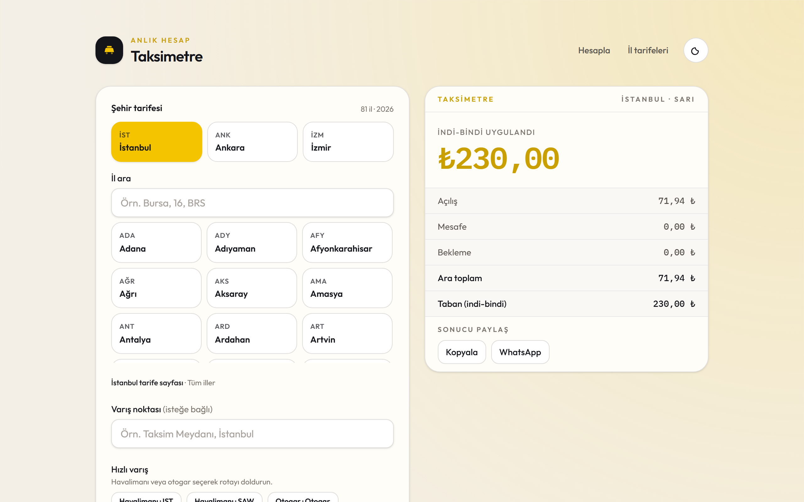
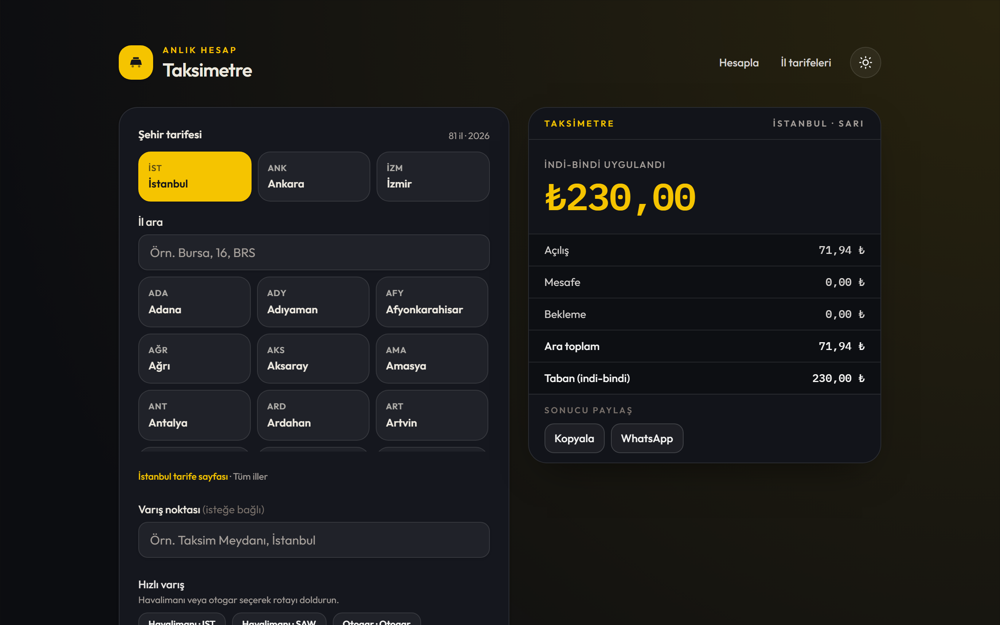
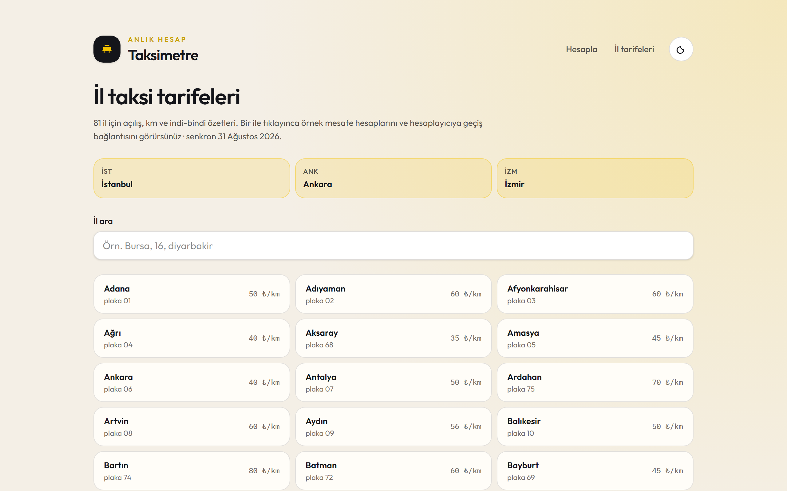
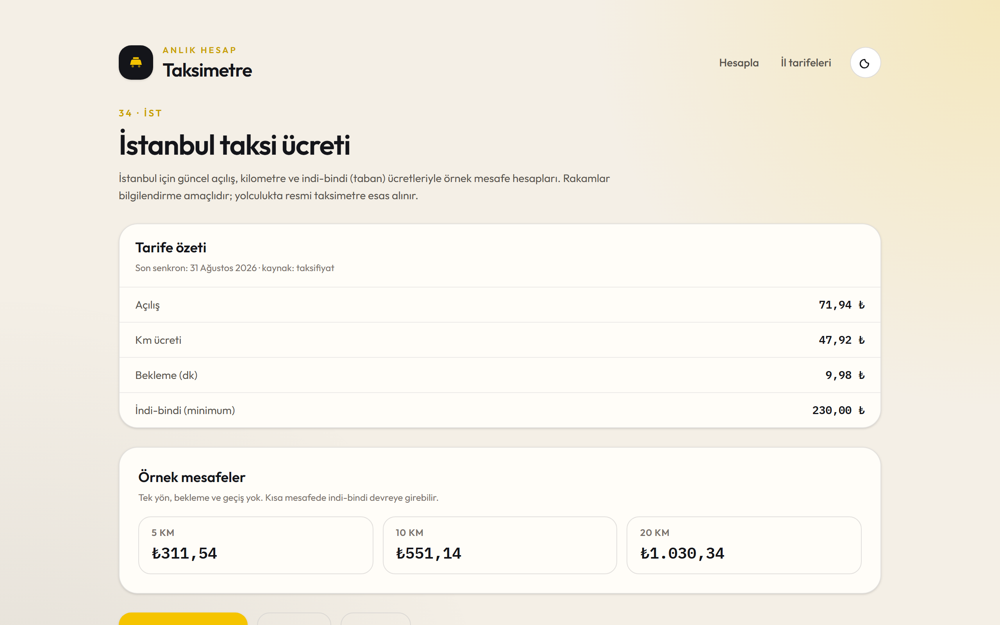

# Taksimetre

Türkiye’de 81 il taksi tarifesiyle mesafe, bekleme ve geçişlere göre ücret hesaplama uygulaması. Canlı yolculuk (GPS), harita rotası, durak rehberi ve şikayet hatları içerir.

**Canlı demo:** [kubradmrgc.github.io/taksimetre](https://kubradmrgc.github.io/taksimetre/) · [İl tarifeleri](https://kubradmrgc.github.io/taksimetre/sehirler) · [İstanbul](https://kubradmrgc.github.io/taksimetre/sehir/istanbul)

<p align="center">
  <a href="https://kubradmrgc.github.io/taksimetre/">
    
  </a>
</p>

<p align="center">
  
</p>

<p align="center">
  
  &nbsp;
  
</p>

Bilgilendirme amaçlıdır; yolculukta resmi taksimetre esas alınır.

## Özellikler

- 81 il tarifesi, İstanbul segmentleri (sarı / turkuaz / 8+1 / siyah)
- Ücret kırılımı, gidiş-dönüş, köprü-tünel geçişleri
- Varış araması + OSRM rota / ücret aralığı
- GPS ile canlı yolculuk ve sapma uyarıları
- Şikayet hatları ve taksi durağı rehberi
- Sonuç paylaşımı, PWA, il SEO sayfaları

## Geliştirme

```bash
npm install
npm run dev
```

```bash
npm run build
npm run preview
```

Konum API’si yalnızca HTTPS veya localhost’ta çalışır.

## Hesap

```
Ara toplam = Açılış + (Mesafe × Km başı) + (Bekleme × Dakika başı)
Yolculuk = max(Ara toplam, İndi-bindi)  [gidiş-dönüş ise ×2]
Nihai tutar = Yolculuk + Geçişler
```

Canlı yolculukta mesafe Haversine ile birikir; hız 10 km/s altındaysa süre beklemeye eklenir.

## Tarifeler

Kaynaklar resmi belediye API’si değildir. Açılış / km / indi-bindi [Hemen Hesap](https://www.hemenhesap.com/arastirma/iller-arasi-taksi-ucretleri-2026) (CC BY 4.0), [taksicilerodasi.com](https://taksicilerodasi.com/tr/ucret-hesapla/), eksik iller [taksi724](https://taksi724.com/taksi-ucreti-hesapla), üzerine yazma [taksifiyat.online](https://taksifiyat.online/). Senkron yalnızca Node’da çalışır.

```bash
npm run sync:tariffs
```

`npm run dev` / `npm run build` öncesi isteğe bağlı senkron çalışır. Bekleme ücreti çoğu tabloda yoktur; İstanbul / Ankara / İzmir için yerel tamamlayıcı vardır.

## İletişim ve duraklar

- Şikayet: `chambersData.json`; kayıt yoksa ALO 153 + belediye santralı
- Duraklar: yerel JSON rehber → Google / Foursquare / Geoapify → OSM

```bash
npm run sync:stands
npm run sync:stands -- --city=adiyaman
cp .env.example .env   # isteğe bağlı API anahtarları
```

## GitHub Pages

`main` push sonrası Actions ile yayınlanır: https://kubradmrgc.github.io/taksimetre/

Ekran görüntülerini yenilemek için: `npm install -D playwright && npx playwright install chromium && node scripts/capture-readme-shots.mjs`
